## Chart Types

1. In Metric Finder, search for and click on the custom metric that you generated in the [previous section](https://smathur-splunk.github.io/workshops/custom_metr). This will open up a chart that we can modify and add to a custom dashboard.

2. Next, we'll explore each type of visualization with this custom metric. Source: [Chart types in Splunk Observability Cloud](https://docs.splunk.com/observability/data-visualization/charts/chart-types.html)

	- Line/area/column chart

		These 3 charts are similar in nature and display MTS values over time. 

		Chart options:

		- Area and column charts can be stacked.
		- Color legend can be displayed for all 3 charts (useful when there are multiple MTS).
		- For the Y-axis, the label, min/max, units, and precision can be configured.

		| Line chart | Area chart | Column chart |
		|---|---|---|
		| 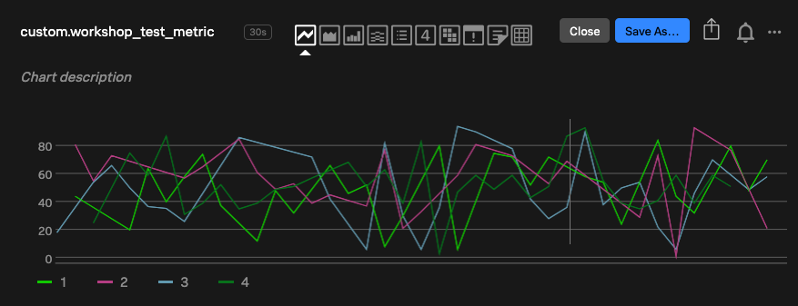 | 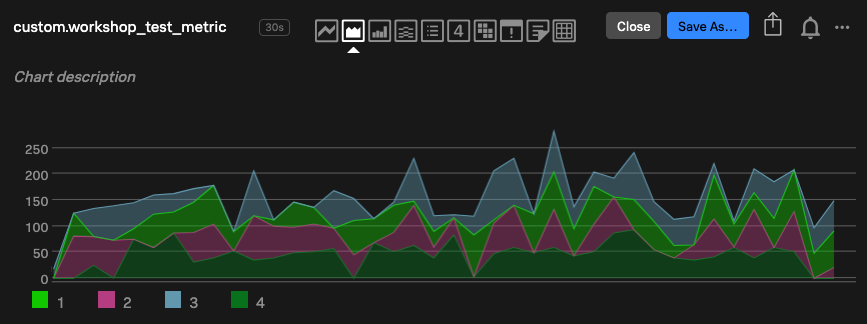 | 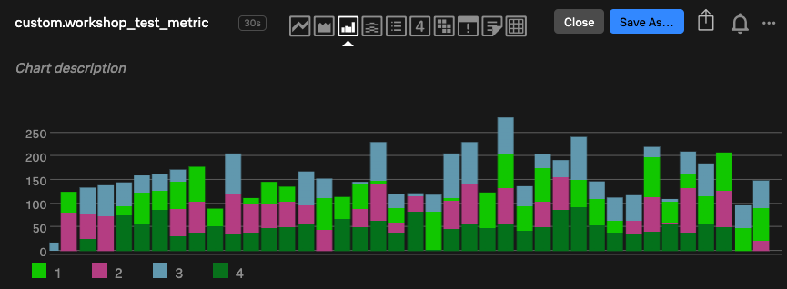 |

	- Histogram

		Histograms will display MTS in a single color. 

		Chart options:

		- For the Y-axis, the label, min/max, units, and precision can be configured.

		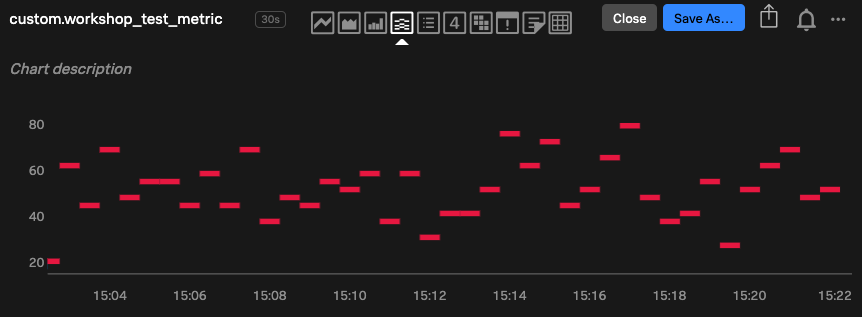

	- List

		Lists are useful for looking at the latest values of multiple MTS. 

		Chart options:

		- Color by value to indicate severity. 
		- Refresh rate, sorting, and precision
		- Dimensions listed next to each value can be shown or hidden as needed (e.g. host name, environment, service name, etc.)
		- A secondary visualization can be enabled to display a sparkline with historical values, or a radial or linear scale for severity.

		

	- Single value

		The single value display behaves similarly to the list view. 

		Chart options:

		- Color by scale
		- Precision, refresh rate
		- Secondary visualizations (sparkline, radial/linear scale)

		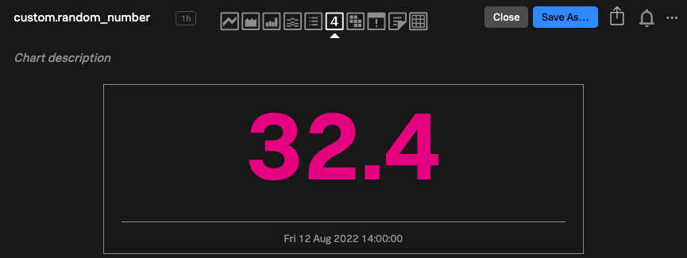

	- Heatmap

		Heatmaps can be used to quickly identify severity across a number of MTS representing individual instances, services, hosts, functions, etc.

		Chart options:
		
		- Refresh rate
		- Sorting, grouping by dimensions
		- Color by fixed or automatic scale

		| Heatmap (custom metric) | Heatmap (demo data) |
		|---|---|
		| 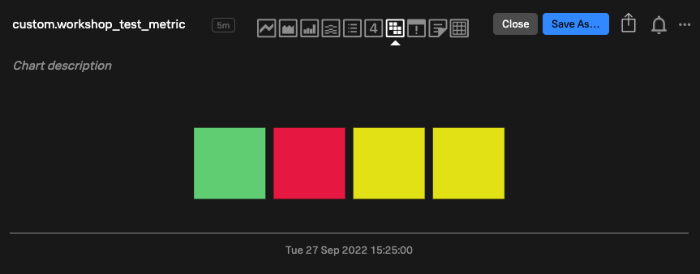 | 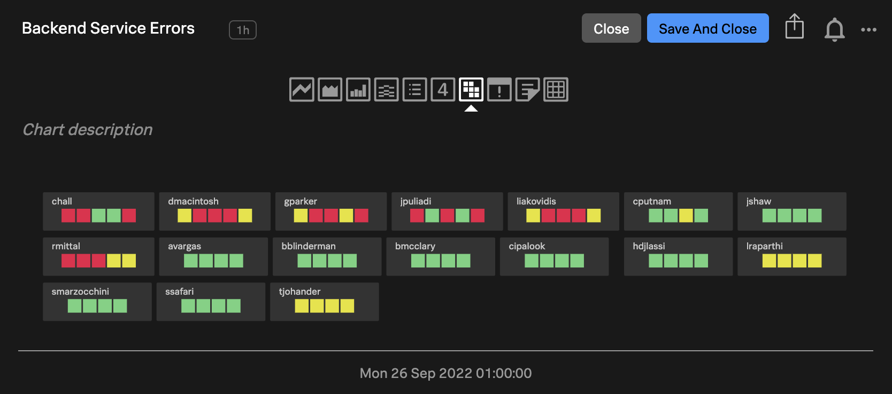 |

	- Table

		Raw data can also be displayed along with its dimensions in the form of a data table. Precision and refresh rate can be customized.

		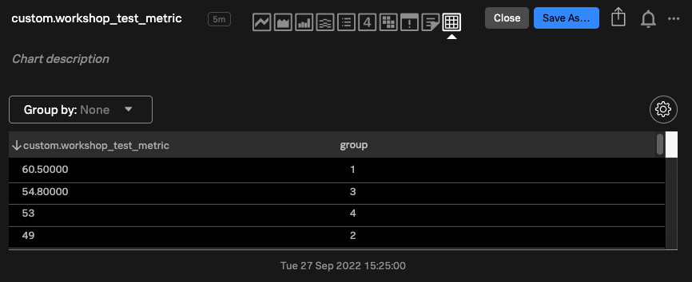

3. After reviewing the various chart types and opening up your custom metric in a chart, select a chart type of your choice. Explore the "Chart Options" tab and customize the chart to your liking.

## Filters

In the previous section [Ingesting Custom Metrics](https://smathur-splunk.github.io/workshops/custom_metr/#setting-custom-properties-and-tags), you set some custom properties and tags after ingesting custom metric data. Now that we're building a chart, we can use those, in addition to the properties defined at ingest, to filter on our chart.

1. In the chart builder, next to your custom metric name, click "Add Filter" and search for a custom property name (not value) or tag that you've created. If filtering by custom property, also specify the value of the property that you want to filter on (* supported).

	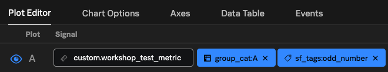

2. You may also want to filter on a dimension such as `group`.

## Analytics Functions

Now that we've set some filters for our chart, there are various analytics functions we can apply, in order to make sense of multiple MTS that may be coming in. For this section to be relevant, you may want to tweak your filters such that you see multiple MTS.

1. Under the F(x) column, click "Add Analytics". Explore the various analytics functions that are available.

	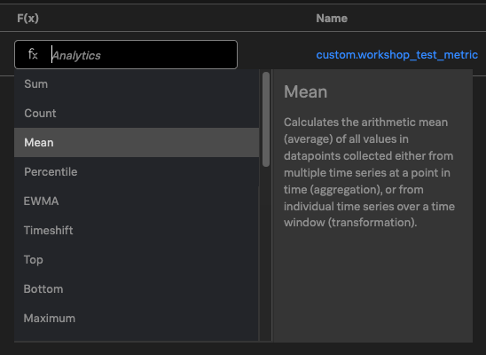

2. Select `Mean` as your analytics function. You'll be asked to pick between `Aggregation` and `Transformation`. Many of the analytics functions allow you to choose between these two options, which will affect how metric data is presented:

	- Aggregation

		- This will perform a typical mean/min/max/etc. calculation, where for each point in time, the mean/min/max/etc. across all MTS is calculated and displayed.

	- Transformation

		- When `Transformation` is selected, a time window will need to be specified. 
		- For this time window, you can choose between a **moving window** or a **calendar window**.
			- If a **calendar window** is specified, the chart will perform the selected function (mean, min, max, etc.) for each cycle, and use that as datapoints for the chart.
				- For example, if `Mean:Transformation` is selected with a `Month` cycle length calendar window, the chart will display 1 point for the mean value of each month.

				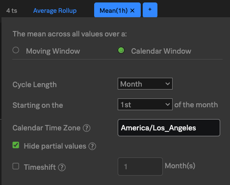

			- If a **moving window** is specified, the chart will show what the moving function (mean, min, max, etc.) value is, looking back the specified amount of time.
				- For example, if `Mean:Transformation` is selected with a moving window of `1 Hour`, then for every datapoint coming in, the mean over the last 1 hour will be calculated and displayed instead of the raw datapoint itself. 

				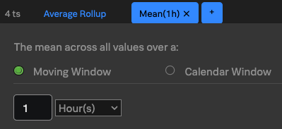

	For more details on aggregation vs transformation, and analytics functions in general, see [Functions reference for Splunk Observability Cloud](https://docs.splunk.com/Observability/data-visualization/charts/chart-analytics-reference.html).

3. Select `Mean:Aggregation`, and group the resulting data by a dimension or custom property if you wish.

## Rollups

Rollups determine how data is presented when datapoints are coming in at a higher resolution than what the chart shows. For example, if 2 datapoints come in every 10 seconds, and the resolution of the chart is set to 10 seconds, the 2 datapoints will need to be combined *somehow* into 1 datapoint to match the chart's resolution.

How those datapoints are combined can depend on the type of metric (guage, counter, cumulative counter). Refer to the table [here](https://smathur-splunk.github.io/workshops/custom_metr_expl/#whats-the-difference-between-a-gauge-and-a-counter) (see the "Default function" column) for a quick look at what rollups align to what type of metric by default. Official documentation on rollups can be found [here](https://docs.splunk.com/observability/data-visualization/charts/data-resolution-and-rollups.html) and [here](https://docs.splunk.com/observability/infrastructure/retention.html#rollups-resolution-and-data-retention-policies).

This rollup is usually automatically determined, but you may want to manually specify which rollup to use for your chart.

1. Under Plot Editor, on the far right side of your plot, click the gear icon to configure the plot.

2. Under Advanced Options, you'll see that the Rollup dropdown was set to `Auto (Average)`, assuming you sent in a gauge metric (since that's the default function for gauges). Select the Rollup dropdown and set it to `Sum`. 

	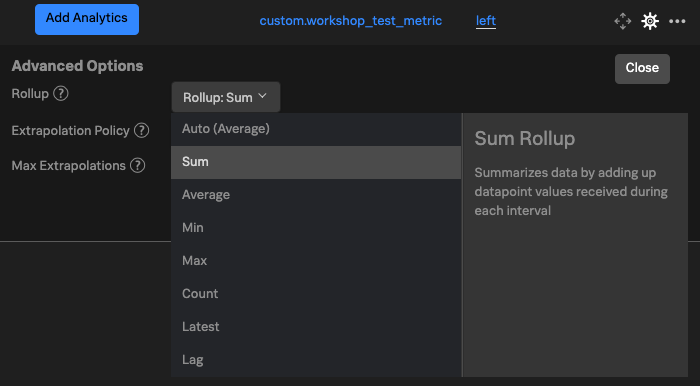

3. You should see that the chart values are higher now, since data is coming in at 5s, the chart has a resolution of 10s, and thus it's combining 2 datapoints into 1 by summing them.

4. Note that under the plot configuration settings, you can also specify:

	- The extrapolation policy that should be used to fill in any gaps (null, zero, or latest value)
	- Max extrpolations: how many times the above extrapolation should be done, before it no longer applies
	- Under Visualization Options, units can be configured so that time or bits/bytes can autoscale when displayed (e.g. display `10s` instead of `10000ms`, but at the same time display `900ms` instead of `0.9s`). Custom units can also be specified.

## SignalFlow

If you click "View SignalFlow" on the top-right corner of the Plot Editor, you'll be able to see the SignalFlow query beneath the plot that you've created just now in the UI. There are many functions that you can leverage with SignalFlow, see the full list [here](https://dev.splunk.com/observability/docs/signalflow/function_method_list).

1. Before moving to the next section, click "Save" on the top-right, and add your chart to a dashboard.