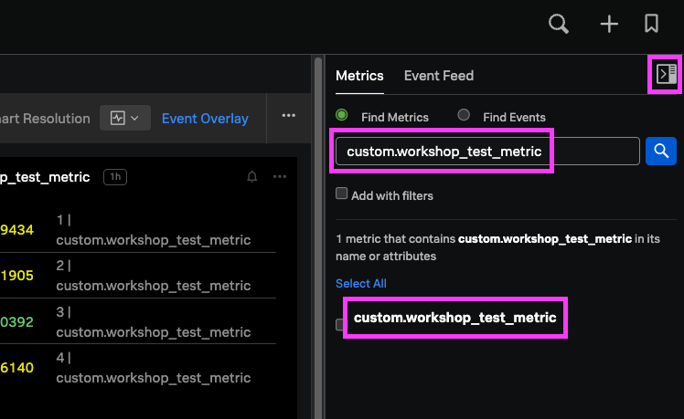
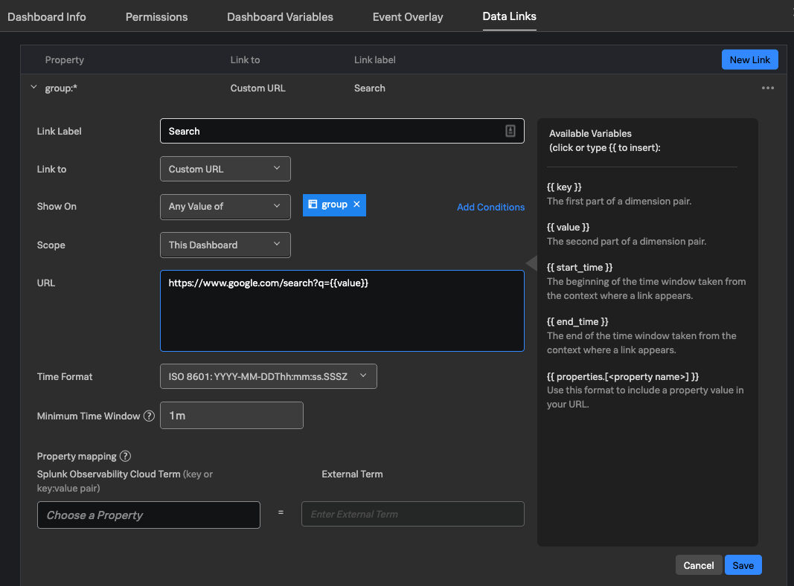
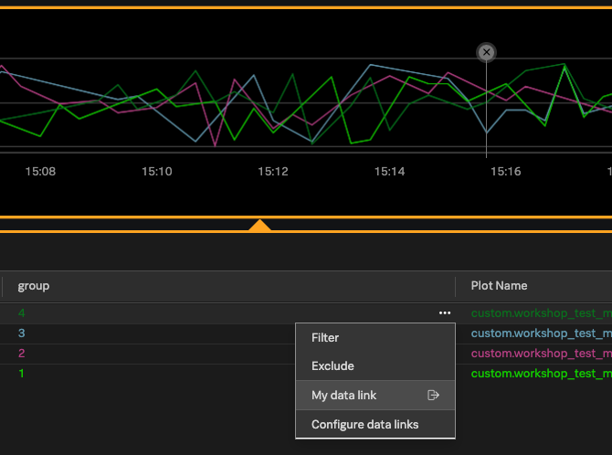

You can quickly customize your dashboards by moving panels around, resizing them, and leveraging the copy-paste functionality to clone and edit charts. This section will discuss some of the more advanced configuration you can do with dashboards, but you may want to spend some time creating a few charts for your dashboard.

1. A quick way to do this is leveraging the Metrics sidebar in dashboards. At the very top-right of the dashboard, click the icon that looks like a half-filled gray square, and make sure the "Metrics" tab is selected.

2. Make sure that "Find Metrics" is selected, and in the search box, type the name of your custom metric. From the results, click the name of your custom metric.

	

3. A default chart should automatically appear on your dashboard for further customization.

## Dashboard Variables

To allow for easy filtering, dropdowns for individual dimensions can be added to the top of a dashboard. 

1. To begin, click the 3 dots at the top-right of the dashboard, and select "Dashboard Variables".

2. Set "Property" to the dimension that you want your dropdown to filter on. Use the "Alias" field to set a more user-friendly name for this dimension that'll appear on the dashboard.

3. Optionally set a default value (`*` allowed), specify if a value for this dropdown is required, and add any suggested values.

4. You can choose if this filter should apply to ALL charts, or if it should only apply to panels that have this dimension. For example, if you have charts pertaining to EC2 and Lambda, and want to add a dropdown only pertaining to EC2, it's best to only apply this filter to charts with the filtered dimension, otherwise your Lambda charts will show no data.

5. Hit save, and you should now see a dropdown has been added to your dashboard for easy filtering!

## Text Notes (Markdown, HTML)

Splunk Observability supports creating "text" panels that support both Markdown and HTML. These panels allow for adding images, which should be converted to base64. Text panels can be useful for dividing a dashboard into sections, making it easier to read.

Here's a sample dashboard that uses text notes with images to organize its panels:

## Data Links

Splunk Observability supports both [global data links](https://docs.splunk.com/Observability/admin/link-metadata-to-content.html) as well as dashboard-specific [local data links](https://docs.splunk.com/Observability/data-visualization/navigate-with-data-links.html). With data links, you can extend functionality of your dashboards by sending dimension data to other resources (within or outside of Splunk).

1. Click the 3 dots at the top-right of the dashboard, and near the bottom of the menu, click "Data Links".

2. In the top-right corner of the pop-up menu that appears, click "New Link".

3. Enter a label, which will be the text you click on when using this data link.

4. In the "Link to" dropdown, you can set this data link to go to Splunk for logging, another Splunk Observability dashboard, Kibana, or even an external URL. Select `Custom URL`.

5. Set "Show on" to `Any value of` the dimension that you added for your custom metric (e.g. `group`).

6. The scope can be set to either this dashboard only, or your entire organization. You may want to set the scope to just this dashboard for now.

7. Lastly, specify the custom URL that you'd like the data link to go to. You can use variables to pass parameters to this URL, such as the dimension value. An example of a URL you could use is `https://www.google.com/search?q={{value}}`. Then click "Save" and close the pop-up window.

	

8. You can now click on a chart, click the 3 dots next to your dimension values, and click your data link to go to the custom URL that you set.

	

## Dashboard Permissions

Part of the strategy you may have with your dashboards is to align them to certain teams or audiences, so setting the right read/write permissions is key.

Permissions can be set individually for each dashboard, or simply inherit permissions from the overarching dashboard group. 

Read/write access can be specified for each user.

