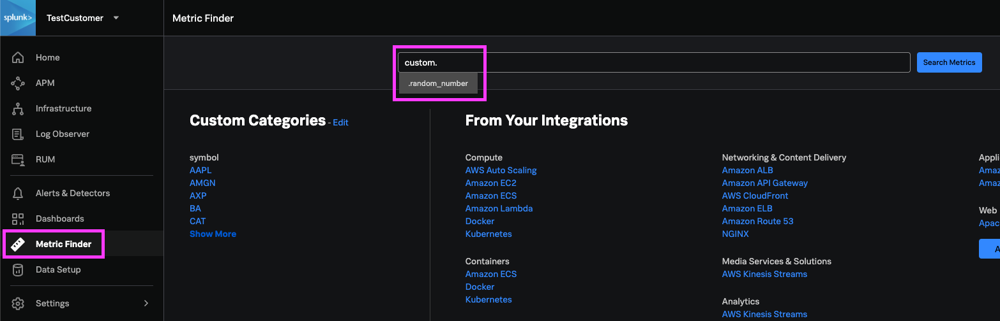

# ⚠️ Under Construction ⚠️
## Finding Custom Metrics
### Query Metrics (API method)

1. Review the table below for a quick guide on querying metrics and metric metadata via the API ([API Reference docs](https://dev.splunk.com/observability/reference/api/metrics_metadata/latest))
 
	| Query | URL |
	|---|---|
	| Query metric | `https://api.<realm>.signalfx.com/v2/metric?query=name:<metricname>` |
	| Query `dimension:value` pair | `https://api.<realm>.signalfx.com/v2/dimension?query=<dim>:<val>` |
	| Check if property exists | `https://api.<realm>.signalfx.com/v2/dimension?query=_exists_:<prop>` |

	*NOTE: The arguments that are passed in the cURL statement must be URL encoded. To find the correct URL encoding for the customer name, refer to [this guide](https://www.w3schools.com/tags/ref_urlencode.ASP). For example: `Buttercup, Inc.` is encoded as `Buttercup%2C%20Inc%2E`.*

2. As an example, try querying the custom metric that you created in the previous section.

	```bash
	curl -X GET "https://api.<realm>.signalfx.com/v2/metric?query=name:<metricname>" \
	    -H "Content-Type: application/json" \
	    -H "X-SF-TOKEN: <value>"
	```

### Metric Finder (UI method)

1. The other way to find metrics in Splunk Observability is using the Metric Finder. From the left sidebar, navigate to Metric Finder. You can view metrics across your various integrations here, and also search for custom metrics.

	

2. With the resulting metrics, you can inspect the related properties. Clicking on the metric name will open up a chart for the metric, which you can use to start building out some custom dashboards and alerts.

	

## Customizing Charts

1. In Metric Finder, search for and click on the custom metric that you generated in the [previous section](https://smathur-splunk.github.io/workshops/custom_metr). This will open up a chart that we can modify and add to a custom dashboard.


### Chart Types

1. Next, we'll explore each type of visualization with this custom metric. Source: [Chart types in Splunk Observability Cloud](https://docs.splunk.com/observability/data-visualization/charts/chart-types.html)

	- Line/area/column chart

		<p float="left">
			
			 
			
		</p>

	- Histogram

		

	- List

		

	- Single value

		

	- Heatmap

		<p float="left">
			
			
		</p>

	- Event feed

	- Text

	- Table

### Filters

### Analytic Functions

### Rollups

### SignalFlow

## Customizing Dashboards
### Dashboard Variables

### Text Notes (Markdown, HTML)

## Dashboard Permissions

Part of the strategy you may have with your dashboards is to align them to certain teams or audiences, so setting the right read/write permissions is key.