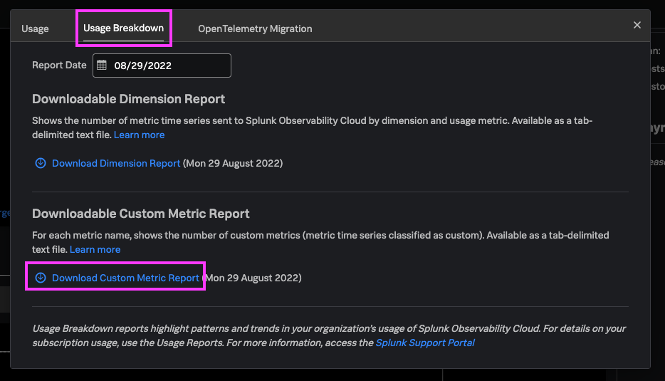

## cURL Ingestion Method

Now that you've got an understanding of the different types of metrics, and the attributes you can apply to them, let's dive into actually creating and sending in some custom metrics!

1. One way to send custom metrics is simply using cURL. To begin, identify your Splunk Observability Cloud realm and access token (must be an **ingest** token).

2. Send in a custom metric using the following command. Specify whether you want it to be a `gauge`, `counter`, or `cumulative counter`. 

	```bash
	curl -X POST "https://ingest.{REALM}.signalfx.com/v2/datapoint" \
	    -H "Content-Type: application/json" \
	    -H "X-SF-Token: <value>" \
	    -d '{
	            "gauge": [
	                {
	                    "metric": "string",
	                    "value": 0,
	                    "dimensions": {
	                        "<property name>": "any"
	                    },
	                    "timestamp": 1557225030000
	                }
	            ]
	        }'
	```

	- **Required:** Set the `{REALM}` and access token (`X-SF-Token`). Replace `string` with the name of the metric, and set the `value` for the metric. Replace `gauge` if you'd like to create a different kind of metric, but this is a required field.
	- **Optional:** You may add key-value pairs under `dimensions` and/or specify the `timestamp` (milliseconds since epoch), but you do not *need* to specify these. For this workshop, it is recommended that you *remove* the timestamp (it will automatically be generated).

3. Run the command, and you should see an output `"OK"`. Congrats, you've just sent in a custom metric! Let's see how we can automate this and potentially leverage it in application code.

### Sources
- [Sending custom datapoints](https://dev.splunk.com/observability/reference/api/ingest_data/latest#endpoint-send-metrics)
- [Full endpoint summary of the Splunk Observability API](https://dev.splunk.com/observability/docs/apibasics/api_list)

## Programmatic Ingestion Method

Similar to using a cURL command to send custom metrics, you can also add POST requests to your code to send relevant data from the code. Conceptually this is the same as using cURL, just with different syntax. Because Python is a common and fairly straightforward use case, it's included here as an example.

### Python

1. Create a Python script that generates custom data at a specified time interval. We will modify this code to send custom metrics to Splunk Observability. As an example, save and run this Python script, which will generate random numbers between 1 and 100, every 5 seconds.

	```python
	from random import *
	import time
	import requests
	import json

	while True:
	    random_number = randint(1, 100)
	    print(random_number)
	    time.sleep(5)
	```

2. Next, modify the script to create a POST request, which will send the random numbers generated as values of a metric. **Inside** the `while` loop from above, add the code below to your Python script. (Make sure this code is indented **one** level, just as it's pasted here.) 

	*Tip: you may want to move `time.sleep(5)` to the bottom of the `while` loop, after the `print` statement.*

	```python
	    metrics_list = []
	    metrics_dimensions = {'DIMENSION_1':'VALUE_1', 'group':str(random_number%4+1)}
	    metrics_list.append({'metric':'METRIC_NAME', 'value':random_number, 'timestamp':int(time.time()*1000), 'dimensions':metrics_dimensions})

	    metrics_data = {'gauge':metrics_list}
	    
	    metrics_url = 'https://ingest.<REALM>.signalfx.com/v2/datapoint'
	    metrics_headers = {'Content-Type':'application/json', 'X-SF-TOKEN':'SPLUNK_ACCESS_TOKEN'}
	    send_metrics = requests.post(metrics_url, headers=metrics_headers, data=json.dumps(metrics_data))

	    print(send_metrics, send_metrics.json())
	```

3. Set `metrics_dimensions` equal to a dict of key-value pairs that you'd like to use as dimensions. As an example, you might set it equal to `{'rng':'python', 'group':str(random_number%4+1)}` (This will create 4 MTS because there will be 4 unique values of the `group` dimension.)

4. Replace `METRIC_NAME` with the desired metric name (you may want to prefix this with `custom.` for easy searching). 

5. Replace `<REALM>` and `SPLUNK_ACCESS_TOKEN` with your corresponding values.

6. The final Python script should look something like [this](https://gist.github.com/smathur-splunk/2f9681884bde5ccb2ca6b30120e65956#file-random_gen-py).
	
	Note that in the code there is a dict called `metrics_data`, which has a key of `gauge` (this is where you specify the metric type), and a value of a list `metrics_list`. That list should contain all the gauge metric data points that you would like to send, with each metric data point represented as a dict. That dict contains the metric name, value, timestamp, and dimensions.

	- This way, multiple metrics/data points can be sent in the same request (this applies to cURL too). 
	- If you're only sending one metric data point, the value for `gauge` (or any other metric type) *still* needs to be a list, it'll just have one item.

	The resulting JSON body would look like this:
	```json
	{
	  "gauge": [
	    {
	      "metric": "custom.random_number",
	      "value": 12,
	      "timestamp": 1660339711614,
	      "dimensions": {
	        "rng": "python",
	        "script": "random_gen.py"
	      }
	    }
	  ]
	}
	```

7. Finally, run the Python script, and you should see an output `<Response [200]> OK`. And that's it! You've got a custom metric automatically being generated by this script.

## Setting Custom Properties and Tags

For easier filtering and organizing of metric data, you can set custom properties and tags for your metrics **after** ingest (see [Metric Dimensions, Custom Properties, and Tags](https://smathur-splunk.github.io/workshops/custom_metr_expl/#metric-dimensions-custom-properties-and-tags)).

1. From the left sidebar, navigate to Settings > Metric Metadata (listed under "Data Configuration"). Search for a dimension, e.g. `group`, pertaining to your custom metric. From the results in the dropdown, select "group - Property".

	

2. From the "group" metadata page, select a value (e.g. 1, 2, 3, or 4) under Values. On the resulting page, you can set custom properties and tags, which can be used later on for easier filtering. Under Properties, click "Add new property", specify a property name (e.g. `group_category`), and specify a property value (e.g. `A` or `B`).

3. Under Tags, click "Add new tag", and enter a tag name such as `odd_number` or `even_number`.

4. Repeat steps 2 and 3 for all the values of "group" (groups 1, 2, 3, and 4). You can now use these custom properties and tags to filter on data when creating charts and dashboards.

	

## Viewing Custom Metrics Usage

Before we take a look at our custom metrics in Splunk Observability, let's see how we can manage custom metrics usage, against our org license. There are a couple ways to do this. *Required: Admin-level access to your org in Splunk Observability.*

### Usage by Token
1. From the left sidebar, go into Settings > Access Tokens (4th from the top). 

	

2. Expand a token that you want to see the usage for, and you'll see a table and a chart (you may have to select "Custom Metrics" in the dropdown above it) showing the number of custom metrics that you have ingested.

	

### Overall Usage
1. From the left sidebar, go into Settings > Subscription Usage. The Infrastructure Monitoring tab should be selected at the top. On the Usage Trends chart, select "Custom Metrics" in the Usage Metric dropdown.

	

2. This is where you can also see the list of custom metrics that you have ingested. On the same page, click Usage Reports > select the Usage Breakdown tab at the top > Download Custom Metric Report.

	