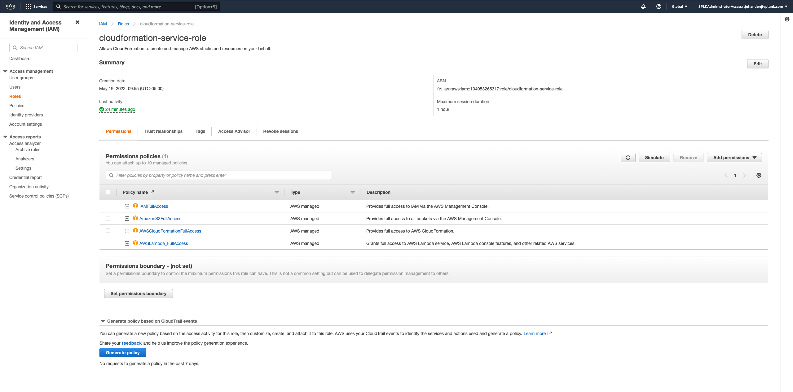
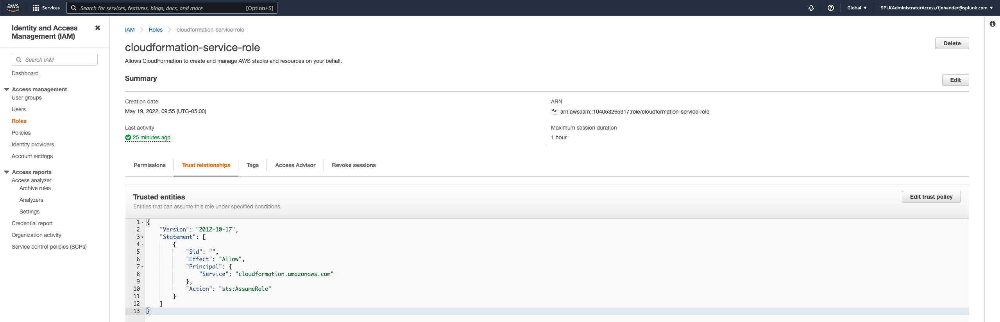

# AWS Lambda --> Splunk APM Workshop

In this workshop, you will create a microservices app (written in Python) out of AWS Lambda functions, using the CloudFormation template provided. You will then instrument the functions to get visibility through Splunk APM. **No coding experience necessary!**

## Requirements
- Access to a Splunk Observability Cloud organization with APM enabled
- Permissions to view APM access tokens in Splunk Observability Cloud
- AWS account
- Permissions to create Lambda functions and S3 buckets in the 'us-east-1' (N. Virginia) region on AWS

### Special Note on AWS Resources Needed To Provision the Demo Resources
Two specific AWS resources are required to run this demo/workshop that are outside the scope of this demo:

#### Cloudformation Service Account
1. An IAM Role that the Cloudformation service will assume to create the resources described in the Cloudformation templates.  This a _different_ role that's used to invoke the lambda functions themselves.  This role is created outside of the project templates.  Since this IAM "user" is needed to build the other resources, it can't be included in the Cloudformation templates for the Lambda demo.  The easiest way to get up and running is to create a Cloudformation Service User Role with the following settings:

After this is created you'll need to note the role ARN to add to the Cloudformation GUI or CLI setup.  In other words, you're going to tell Cloudformation to run as this Service Account to generate all the demo resources.
