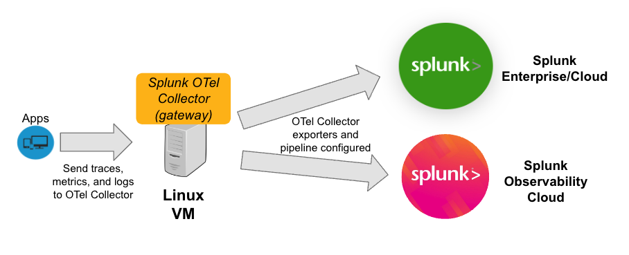

# OTel Gateway Setup

Auto-instrument a Java app to send trace and metric data to both Splunk Enterprise/Cloud & Splunk Observability Cloud, via OTel running in gateway mode. 

This was initially set up for a POC where the host running the Java app could not have the OTel collector installed, hence the setup seen in the architecture diagram below.

## Requirements
### Components
- Java app
- Linux VM to be used as the OTel collector gateway
- Splunk Cloud/Enterprise
- Splunk Observability Cloud trial/license

### Networking Ports
- Splunk Cloud/Enterprise: `8088` (HEC endpoint)
- VM for OTel Gateway: `4317` (OTLP gRPC endpoint for logs), `4318` (OTLP HTTP endpoint for cURL), `9943` (for metrics)