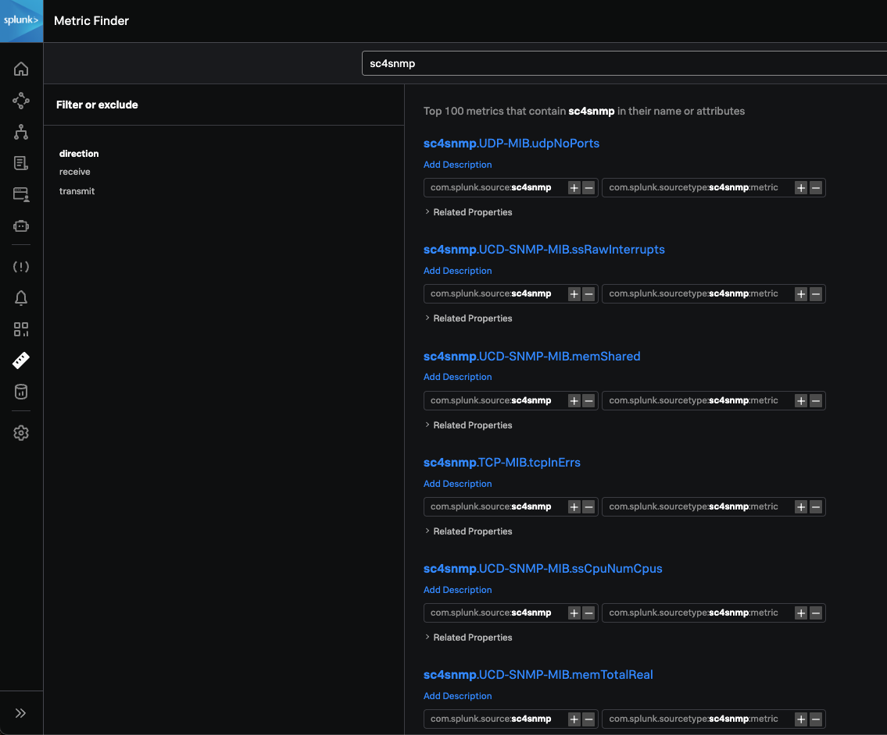
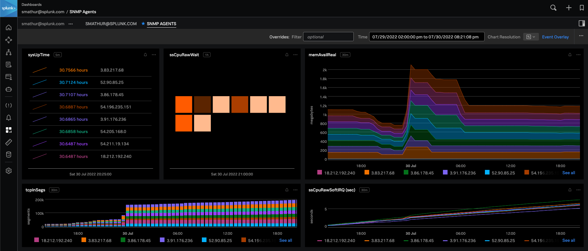

### ❗System requirements❗ 
You MUST follow these specs or it will not work as intended. `t2.xlarge` is the most cost-effective AWS EC2 instance type for this.

- 4 cores
- 8GB memory
- 50GB storage

### Steps
1. On a separate machine to be used as the SC4SNMP host, follow all the steps on the [Splunk Connect for SNMP using MicroK8s](https://splunk.github.io/splunk-connect-for-snmp/main/gettingstarted/mk8s/k8s-microk8s) guide. Copied below just in case:
```bash
sudo snap install microk8s --classic

sudo usermod -a -G microk8s $USER
sudo chown -f -R $USER ~/.kube
sudo su - $USER
microk8s status --wait-ready

sudo systemctl enable iscsid
microk8s enable helm3
microk8s enable storage
microk8s enable rbac
microk8s enable community
microk8s enable openebs
microk8s status --wait-ready

microk8s enable dns:208.67.222.222,208.67.220.220
microk8s status --wait-ready

microk8s enable metallb:<SC4SNMP_PUBLIC_IP>-<SC4SNMP_PUBLIC_IP>
microk8s status --wait-ready
```
\* *The DNS being used here is OpenDNS. You may use whichever you like.*

2. Run the command
`microk8s helm3 repo add splunk-otel-collector-chart https://signalfx.github.io/splunk-otel-collector-chart`

3. For **Splunk Observability**, run:
```bash
microk8s helm3 upgrade --install sck \
  --set="clusterName=<CLUSTER_NAME>" \
  --set="splunkObservability.realm=<REALM>" \
  --set="splunkObservability.accessToken=<API_INGEST_TOKEN>" \
  --set="splunkObservability.ingestUrl=https://ingest.<REALM>.signalfx.com" \
  --set="splunkObservability.apiUrl=https://api.<REALM>.signalfx.com" \
  --set="splunkObservability.metricsEnabled=true" \
  --set="splunkObservability.tracesEnabled=false" \
  --set="splunkObservability.logsEnabled=false" \
  splunk-otel-collector-chart/splunk-otel-collector
```
For **Splunk Enterprise/Cloud**, you will need to create the indexes as described in the [SC4SNMP Requirements](https://splunk.github.io/splunk-connect-for-snmp/main/gettingstarted/splunk-requirements) and generate a HEC token pointing to those indexes. Then run:
```bash
microk8s helm3 upgrade --install sck \
  --set="clusterName=<CLUSTER_NAME>" \
  --set="splunkPlatform.endpoint=http://<SPLUNK_ENTERPRISE_IP>:8088/services/collector" \
  --set="splunkPlatform.insecureSkipVerify=true" \
  --set="splunkPlatform.token=<SPLUNK_HEC_TOKEN>" \
  --set="splunkPlatform.metricsEnabled=true" \
  --set="splunkPlatform.metricsIndex=em_metrics" \
  --set="splunkPlatform.index=em_logs" \
  splunk-otel-collector-chart/splunk-otel-collector
```

4. Run the commands:
```bash
microk8s helm3 repo add splunk-connect-for-snmp https://splunk.github.io/splunk-connect-for-snmp
microk8s helm3 repo update
```

5. Save the corresponding configuration for your environment, either the [Splunk Observability config](https://gist.githubusercontent.com/smathur-splunk/4660aab9c9aed7bac8bc95c20ec6afb4/raw/257b48c476cecb33685ba2641e9b510bf5bf7077/splunk_o11y_values.yaml) or the [Splunk Enterprise/Cloud config](https://gist.githubusercontent.com/smathur-splunk/4660aab9c9aed7bac8bc95c20ec6afb4/raw/257b48c476cecb33685ba2641e9b510bf5bf7077/splunk_enterprise_values.yaml), into a file called `values.yaml`. Replace the values in all uppercase (**this is where you specify which agents to poll from**--look for `<SNMP_AGENT_IP>`).

6. Finally, run:
```bash
microk8s helm3 install snmp -f values.yaml splunk-connect-for-snmp/splunk-connect-for-snmp --namespace=sc4snmp --create-namespace
```
When making any further changes to `values.yaml`, run:
```bash
microk8s helm3 upgrade --install snmp -f values.yaml splunk-connect-for-snmp/splunk-connect-for-snmp --namespace=sc4snmp --create-namespace
```

7. To see the pods created, run `microk8s kubectl get pods -n sc4snmp`

8. To check the logs for SC4SNMP, use the command above to get the pod names, and run:
`microk8s kubectl logs -f snmp-splunk-connect-for-snmp-inventory-<INVENTORY_POD_NAME> -n sc4snmp`, replacing the pod name with the last part of the "inventory" pod name.
You should see a line that says `New Record address='<SNMP_AGENT_IP>'`.

9. And that's it! You should now see metrics in Splunk Observability by going to Metric Finder and searching for `sc4snmp`. 

	

	To see events in Splunk Enterprise/Cloud, search:
	```sql
	index="netops" sourcetype="sc4snmp:event"
	```
	And to see metrics in Splunk Enterprise/Cloud, search:
	```sql
	| mpreview index="netmetrics" | search sourcetype="sc4snmp:metric"
	```


